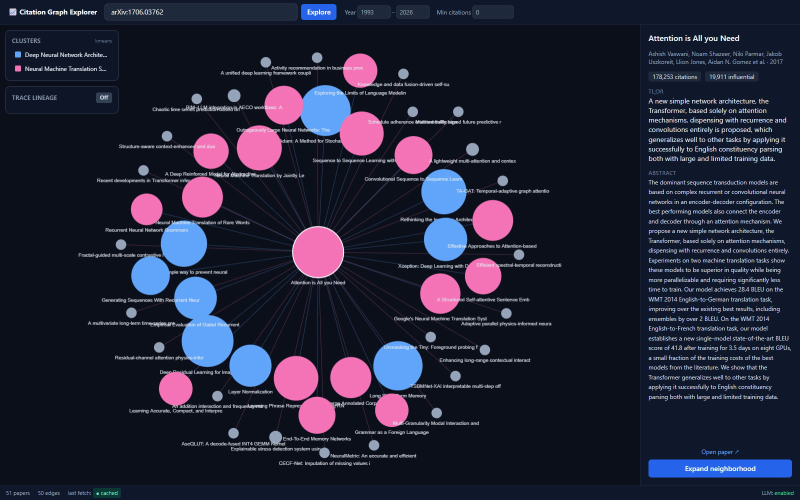

# 📈 Citation Graph Explorer

> An interactive citation-graph tool for literature review. Enter a seed paper and
> explore its intellectual neighborhood — references and citations pulled live from
> Semantic Scholar, papers clustered into themes, and the lineage between any two
> papers narrated by Claude.



---

## What it does

Type in a seed paper (arXiv ID, DOI, Semantic Scholar ID, a URL, or a title) and the
app builds an explorable citation graph around it:

- **🔍 Resolve any paper** — `arXiv:1706.03762`, a DOI, an S2 id, a URL, or a title search.
- **🕸️ Explore on demand** — the graph starts at the seed's immediate neighborhood and
  **never auto-expands**. Click any node to expand *its* neighborhood; new papers merge
  into the existing graph (deduped by paper id).
- **🎨 Themed clusters** — papers are clustered from their SPECTER2 embeddings, and each
  cluster gets a short, LLM-generated theme label (plus an optional 1–2 sentence summary)
  shown in a toggle-able legend.
- **🧬 Lineage tracing** — pick two papers and the app finds the shortest path through the
  citation edges, then has Claude narrate how the ideas progressed from one to the other.
- **🧲 Find similar** — select any paper and instantly rank the rest of the loaded graph by
  SPECTER2 cosine similarity (a free, local "more like this" — no API call). Matches are
  highlighted in the graph and listed by score.
- **🧭 Discover related papers** — pull recommendations from Semantic Scholar for any node
  and add the ones you want; they join the graph on a dashed "suggested" edge (nothing is
  auto-added).
- **📖 Explain & analyze** — a plain-language "Explain this paper" for any node, and a
  graph-wide **Landscape** briefing that summarizes the themes and points at research gaps.
- **⭐ Reading list & export** — star papers into a collection and export the list or the
  whole graph to **BibTeX / RIS / JSON**, or snapshot the graph as **PNG**.
- **💾 Sessions** — your exploration auto-saves to the browser and offers to restore on the
  next visit; you can also save/load a session as a JSON file.
- **⚡ Instant & free on re-runs** — every Semantic Scholar response and every LLM output
  is cached in SQLite, with a live **● cached / ● live** indicator for nerd-cred.

Loads with **"Attention Is All You Need"** as the default seed so there's a rich,
recognizable graph on first open.

## Why it's built this way

The frontend **only ever talks to the backend** — never directly to Semantic Scholar or
the Claude API. That keeps caching and rate-limiting in one place and the API keys off the
client entirely.

```
 ┌──────────────────────┐      /api      ┌──────────────────────┐
 │  Vite + React + d3    │ ─────────────► │   FastAPI backend    │
 │  react-force-graph-2d │ ◄───────────── │                      │
 └──────────────────────┘                └───────────┬──────────┘
                                                      │
                          ┌───────────────────────────┼───────────────────────────┐
                          ▼                            ▼                           ▼
                 Semantic Scholar           Claude API (Anthropic)         SQLite cache
                 Graph API (papers,         labels + lineage               (S2 responses,
                 refs, citations,           narration                       LLM outputs,
                 embeddings, tldr)                                          paper records)
```

## Key behaviors (by design)

| Concern | How it's handled |
|---|---|
| **No runaway graphs** | Each expansion is capped at **≤25 references + ≤25 citations**, ranked by `influentialCitationCount` (fallback `citationCount`). |
| **Free metadata** | Uses Semantic Scholar's free `tldr` (one-line summary) and `embedding` (SPECTER2) fields instead of paying an LLM for them. |
| **Polite API use** | All S2 calls are throttled to **≤1 request/second** (raised with an optional `S2_API_KEY`), with exponential backoff on HTTP 429/5xx. |
| **Works without keys** | No Anthropic key? Cluster labels + lineage narration are gracefully disabled and the UI says so — everything else still works. |
| **Clustering fallback** | KMeans over embeddings (k chosen by silhouette); falls back to Louvain community detection (networkx) when embeddings are sparse. |

## Quickstart

> Full instructions, env vars, and the S2 rate-limit rules are in **[CLAUDE.md](CLAUDE.md)**.

```bash
# 1. Backend (Python 3.11+)
python -m venv .venv && .venv/Scripts/activate      # Windows
pip install -r backend/requirements.txt
cp backend/.env.example backend/.env                # optional: add ANTHROPIC_API_KEY / S2_API_KEY
cd backend && python -m uvicorn app.main:app --reload --port 8000

# 2. Frontend (Node 18+) — in a second terminal
cd frontend && npm install && npm run dev           # http://localhost:5173
```

Or build the frontend (`npm run build`) and the backend will serve it from a single port at
http://127.0.0.1:8000.

## Environment variables (both optional)

| Variable | Effect |
|---|---|
| `ANTHROPIC_API_KEY` | Enables all LLM features: cluster labels + summaries, lineage narration, "Explain this paper", and the Landscape gap analysis. |
| `S2_API_KEY` | Raises Semantic Scholar throughput and makes title search reliable. |

Keys live only in `backend/.env`, which is gitignored — never committed.

## Tech stack

- **Backend:** Python, FastAPI, httpx, SQLite, scikit-learn (KMeans), networkx (Louvain),
  the Anthropic SDK.
- **Frontend:** Vite, React, Tailwind CSS, `react-force-graph-2d` (d3-force).
- **Data:** [Semantic Scholar Graph API](https://api.semanticscholar.org/api-docs/graph) ·
  **LLM:** Claude (Anthropic Messages API).

## Notes

- **Title search** uses S2's `/paper/search` endpoint, which is heavily throttled when
  keyless (frequent 429s). ID-style lookups (`arXiv:…`, DOI, S2 id, URL) are reliable
  without a key; set `S2_API_KEY` for dependable title search.
- This is a personal/portfolio project and is not affiliated with Semantic Scholar or
  Anthropic.
